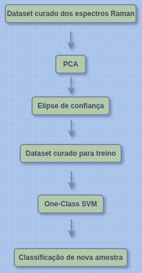
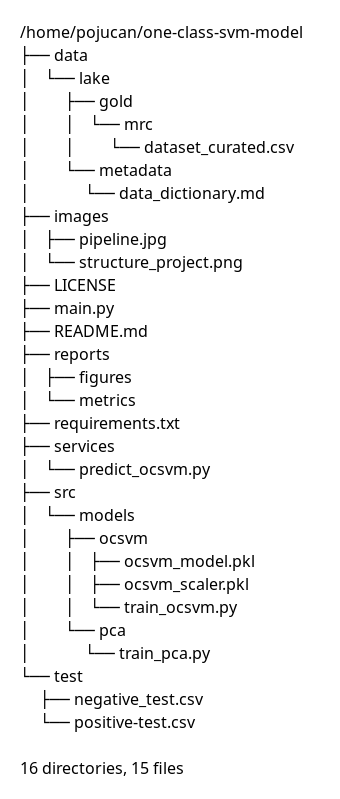

# One-Class SVM para Classificação de Espectros Raman de Óxido de Grafeno


Pipeline de aprendizado de máquina para **classificação de espectros Raman de Óxido de Grafeno (GO)** utilizando **Análise de Componentes Principais (PCA)** e **One-Class Support Vector Machine (OCSVM)**.

O projeto identifica um **comportamento espectral predominante** a partir de elipses de confiança no PCA e treina um modelo de detecção de anomalias capaz de classificar se uma nova amostra é **compatível com o padrão espectral esperado de óxido de grafeno**.

---

# Sumário

- [Introdução](#introdução)
- [Óxido de Grafeno e Espectroscopia Raman](#óxido-de-grafeno-e-espectroscopia-raman)
- [Arquitetura do Projeto](#arquitetura-do-projeto)
- [Estrutura do Projeto](#estrutura-do-projeto)
- [Preparação do Ambiente](#preparação-do-ambiente)
- [Visão Geral do Pipeline](#visão-geral-do-pipeline)
- [Descrição dos Scripts](#descrição-dos-scripts)
- [Guia de Execução](#guia-de-execução)
- [Saídas Geradas](#saídas-geradas)
- [Interpretação Científica](#interpretação-científica)
- [Solução de Problemas](#solução-de-problemas)
- [Licença](#licença)

---

# Introdução

A **espectroscopia Raman** é uma técnica analítica não destrutiva amplamente utilizada para caracterização estrutural de materiais à base de carbono.

No caso do **óxido de grafeno (Graphene Oxide – GO)**, a análise Raman é particularmente importante porque permite investigar:

- defeitos estruturais;
- grau de desordem cristalina;
- oxidação do material;
- qualidade estrutural do carbono sp².

Neste projeto, são utilizadas três propriedades espectrais extraídas dos espectros Raman, podendo ser outras, de acordo com a necessidade do usuário:

| Variável | Descrição |
|----------|------------|
| `D_centro` | Posição da banda D, associada a defeitos estruturais |
| `G_centro` | Posição da banda G, associada ao carbono grafítico sp² |
| `G_fwhm` | Largura à meia altura (*Full Width at Half Maximum*) da banda G |

Esses descritores são usados para treinar um modelo **One-Class SVM**, capaz de determinar se uma nova amostra Raman é **compatível com uma população de referência de óxido de grafeno**.

---

# Óxido de Grafeno e Espectroscopia Raman

## Banda D (~1350 cm⁻¹)

A **banda D** está relacionada a:

- defeitos estruturais;
- desordem na rede cristalina;
- grupos funcionais oxigenados;
- defeitos induzidos por oxidação.

Quanto maior a presença de defeitos, maior tende a ser a intensidade da banda D.

---

## Banda G (~1580 cm⁻¹)

A **banda G** está associada:

- às vibrações no plano do carbono sp²;
- à organização grafítica;
- ao grau de grafitização.

Mudanças na posição da banda G podem indicar alterações químicas no material.

---

## FWHM da Banda G

A **largura à meia altura (FWHM)** fornece informações sobre:

- heterogeneidade estrutural;
- qualidade cristalina;
- nível de desordem do material.

Bandas mais largas geralmente sugerem maior desordem estrutural.

---

# Arquitetura do Projeto

O pipeline do projeto segue o fluxo abaixo:

<div align="center">
  
</div>

---

# Estrutura do Projeto

<div align="center">
  
</div>

---

# Preparação do Ambiente

## 1. Clonar o repositório

```bash
git clone git@github.com:pojucan/one-class-svm-model.git
cd one-class-svm-model
```

---

## 2. Criar ambiente virtual

### Linux / macOS

```bash
python3 -m venv .venv
source .venv/bin/activate
```

### Windows

```powershell
python -m venv .venv
.venv\Scripts\activate
```

---

## 3. Instalar dependências

```bash
pip install --upgrade pip
pip install -r requirements.txt
```
**Obs.:** A UI não está presente neste repositório, mas o projeto já inclui a dependência QtPy para futuros dashboards ou aplicações desktop.

Versão recomendada do Python:

```text
Python 3.10+
```

---

# Visão Geral do Pipeline

O pipeline é composto por **três etapas principais**.

### Execução completa

Para utilizar a aplicação é necessário executar o orquestrador na raiz do projeto: `main.py` 

```bash
python3 main.py
```

Em seguida, começa a execução automática das etapas:

## Etapa 1 — Treinamento do PCA

Arquivo:

```bash
src/models/pca/train_pca.py
```

Quando solicitado na interface, usar todas as variáveis disponíveis no `dataset_curated.csv`:

```text
all
```

Ou selecionar variáveis específicas de acordo com o escopo do trabalho do usuário:

```text
5,13,14
```

### O que o script `train_pca.py` faz?

- lê o dataset Raman curado em:
  `data/lake/gold/mrc/dataset_curated.csv`;
- permite selecionar variáveis interativamente;
- padroniza os dados;
- executa PCA em:
  `src/models/pca/train_pca.py`;
- gera elipses de confiança;
- encontra a elipse predominante;
- exporta datasets filtrados em:
  `reports/metrics`.

### Saídas geradas

- gráfico PCA em:
  `reports/figures`;
- biplot do PCA em:
  `reports/figures`;
- gráfico de loadings em:
  `reports/figures`;
- dataset predominante em:
  `reports/metrics`.

---

## Etapa 2 — Treinamento do One-Class SVM

Automaticamente, o orquestrador `main.py` executa em seguida o treinamento do modelo One-Class SVM (`train_ocsvm.py`) por meio do dataset predominante gerado pelo `train_pca.py`:

```bash
src/models/ocsvm/train_ocsvm.py
```

### O que o script `train_ocsvm.py`faz?

- carrega o dataset predominante do PCA;
- padroniza os dados;
- treina o modelo One-Class SVM;
- salva modelo e scaler.

### Hiperparâmetros utilizado pelo modelo

```python
kernel="rbf"
gamma="auto"
nu=0.05
```

### Execução

```bash
python3 src/models/ocsvm/train_ocsvm.py
```

### Artefatos gerados

```text
src/models/ocsvm/ocsvm_model.pkl
src/models/ocsvm/ocsvm_scaler.pkl
```

---

## Etapa 3 — Predição

Arquivo:

```bash
services/predict_ocsvm.py
```

### O que o script `predict_ocsvm.py` faz?

- carrega modelo treinado: `src/models/ocsvm/ocsvm_model.pkl`;
- carrega scaler: `src/models/ocsvm/ocsvm_scaler.pkl`;
- lê uma nova amostra CSV: `test/negative_test.csv`ou `test/positive_test.csv` de acordo com a configuração do usuário;
- realiza normalização;
- executa predição;
- calcula score de similaridade.

### Exemplo de saída

```text
==================================================
 Avaliação da amostra: positive-test.csv
==================================================
Parâmetros da amostra:
  D_centro : 1348.20
  G_centro : 1582.50
  G_fwhm   : 89.30
--------------------------------------------------
Amostra COMPATÍVEL com GO
Score de similaridade: 0.4213
==================================================
```

### Executando com um arquivo `.csv` referente à uma amostra qualquer de GO

O usuário pode submeter qualquer outra amostra de GO para a avaliação com esse modelo. Essa é a relevância da aplicação. Desde que os parâmetros da amostra contidos no arquivo `.csv` sejam os mesmos determinados nas etapas anteriores: 

```bash
python3 services/predict_ocsvm.py test/other-sample.csv
```

### Resumo de funcionalidades da aplicação

| Script                        | Propósito                                                                                                             | Entrada                                                                  | Saída                                                                     |
|-------------------------------|-----------------------------------------------------------------------------------------------------------------------|--------------------------------------------------------------------------|---------------------------------------------------------------------------|
| src/models/train_pca.py       | Executa PCA interativo (escolha de colunas); gera elipses, biplot, loadings e salva o dataset da elipse predominante. | data/lake/gold/mrc/mrc_total_curated_data.csv (Gold)                     | - PNGs em reports/figures/ - CSVs em reports/metrics/ (dataset da elipse) |
| src/models/train_ocsvm.py     | Treina One‑Class SVM usando apenas as amostras da elipse predominante.                                                | CSV gerado por train_pca.py (primeiro que contenha “PREDOMINANTE”)       | src/models/ocsvm/ocsvm_model.pkl + ocsvm_scaler.pkl                       |
| src/services/predict_ocsvm.py | Carrega o modelo/escala, recebe um CSV com as três métricas e devolve a classificação.                                | CSV com colunas D_centro, G_centro, G_fwhm (ex.: test/negative_test.csv ou test/positive_test.csv) | Texto no terminal (predição e score)                                      |
| main.py                       | Orquestra a execução sequencial de train_pca → train_ocsvm → predict_ocsvm.                                           | —                                                                        | Mensagens de progresso + chamada dos scripts acima                        |

---

# Saídas Geradas

## Figuras

Salvas em:

```text
reports/figures/
```

Incluem:

- gráfico PCA;
- biplot PCA;
- loadings das componentes principais.

---

## Métricas

Salvas em:

```text
reports/metrics/
```

Incluem:

- dataset predominante;
- subconjuntos filtrados do Raman.

---

## Modelo Treinado

Salvo em:

```text
src/models/ocsvm/
```

Inclui:

- modelo treinado (`.pkl`);
- scaler (`.pkl`).

---

# Interpretação Científica

### Análise de Componentes Principais

| Figura | Descrição |
|--------|-----------|
| **PCA** | Dispersão dos dois primeiros componentes com elipses de 2 σ para cada formulação (`prefixo`). Cada elipse tem um label numérico indicando a quantidade de pontos dentro dela. |
| **Biplot** | Mesmo scatter, porém com vetores das variáveis originais (`D_centro`, `G_centro`, `G_fwhm`). O vetor indica a direção de maior correlação com os componentes. |
| **Loadings** | Barras que mostram o peso (loading) de cada feature em PC1 e PC2. |

O **One-Class SVM** aprende a **região espectral normal do óxido de grafeno**.

### Interpretação da predição

| Predição | Significado |
|----------|--------------|
| `1` | Amostra compatível com o padrão de GO |
| `-1` | Amostra fora do padrão esperado |

O **score de similaridade** indica quão próxima uma amostra está do comportamento Raman aprendido.

Valores mais altos tendem a indicar maior compatibilidade.

---

# Solução de Problemas

## Arquivo não encontrado

É necessário o usuário criar o diretório e submeter o `dataset_curated.csv` a ser utilizado. Verifique se existe:

```text
data/lake/gold/mrc/dataset_curated.csv
```

---

## Colunas ausentes

As colunas utilizadas em `services/predict_ocsvm.py` precisam estar de acordo com as escolhidas no modelo PCA (`src/models/pca/train_pca.py`). Exemplo:

```text
D_centro
G_centro
G_fwhm
```

---

## Modelo não encontrado

Treine o modelo antes caso não queira utilizar o orquestrador `main.py`:

```bash
python3 src/models/ocsvm/train_ocsvm.py
```

---

## 10.  Contribuindo  

1. **Fork** o projeto.  
2. Crie uma branch para sua feature ou bug‑fix (`git checkout -b minha‑feature`).  
3. Faça commits claros e pequenos.  
4. Abra um **Pull Request** descrevendo a mudança.  

Para questões de reprodutibilidade, inclua sempre:

* Atualização do `requirements.txt` (use `pip freeze > requirements.txt`).  
* Testes que cubram a nova funcionalidade.  

---

# Licença

Este projeto está licenciado sob a **Apache License 2.0**.

Consulte o arquivo [`LICENSE`](./LICENSE) para mais detalhes.

Copyright © 2026 Marcello Pojucan Magaldi Santos
